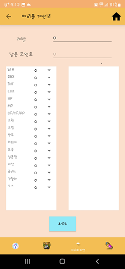

# MapleCal

<p>
    <h1 align="center">
            메이플 계산기
    </h1>
</p>

<p align="center">
    <a href="https://travis-ci.org/steverichey/google-play-badge-svg">
        
    </a>
    <a href="./license.md">
        
    </a>
</p>

<p align="center">
  • <a href="#about">About</a>
  • <a href="#screen-shot">Screen shot</a>
  • <a href="#license">License</a>
</p>


## About

메이플스토리 게임을 하면서 계산이 필요한 것들을 수치만 입력하여 빠르게 계산을 해주는 어플리케이션입니다.

- 심볼 계산기
    - 계산하고싶은 심볼을 선택해 레벨, 개수를 입력하면 만렙이 언제되는지, 메소가 얼마나 필요한지 계산해줍니다.<br/><br/>
- 몬스터파크 계산기
    - 계산하고싶은 요일 뱃지를 선택해 현재까지 한 횟수와 메포사용 횟수를 입력하면 뱃지를 언제 획득하는지와 그때까지 사용되는 메이플 포인트값을 계산해줍니다.<br/><br/>
- 하이퍼스텟 계산기
    - 본인의 레벨을 입력하고 각 스텟의 레벨을 설정하여 직접 분배하면 각 스텟의 상승량과 남은 포인트를 계산해줍니다.<br/><br/>
- 극성비 계산기
    - 원하는 캐릭터 닉네임을 입력하여 레벨과 경험치 퍼센트를 가져와 사용할 성장의 비약의 개수를 입력하면 그 비약을 다 사용했을시 레벨과 경험치 퍼센트를 계산해줍니다.

## Screen shot
<p align="center">
        
        <br>
        
        <br>
</p>

## License

```
Copyright 2022 Hancheol Shin

Licensed under the Apache License, Version 2.0 (the "License");
you may not use this file except in compliance with the License.
You may obtain a copy of the License at

    http://www.apache.org/licenses/LICENSE-2.0

Unless required by applicable law or agreed to in writing, software
distributed under the License is distributed on an "AS IS" BASIS,
WITHOUT WARRANTIES OR CONDITIONS OF ANY KIND, either express or implied.
See the License for the specific language governing permissions and
limitations under the License.
```
